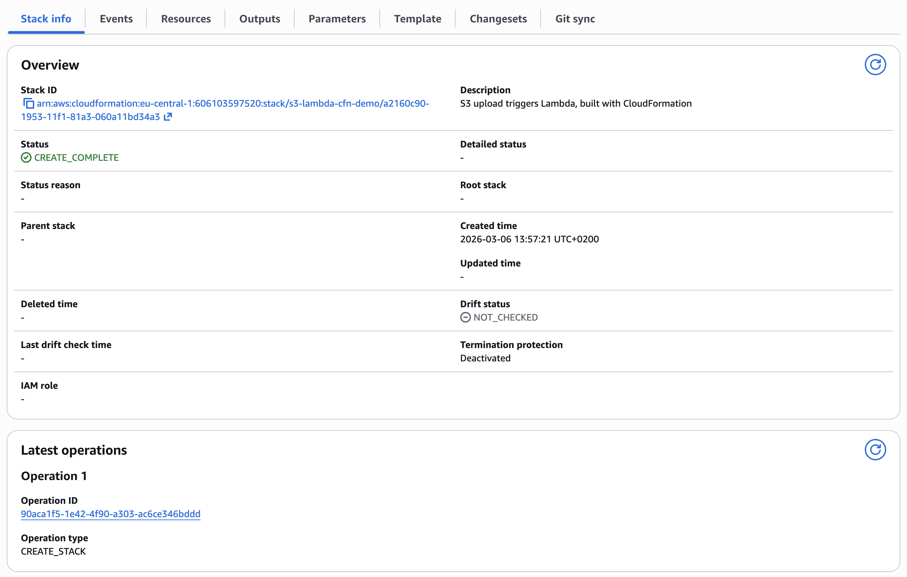
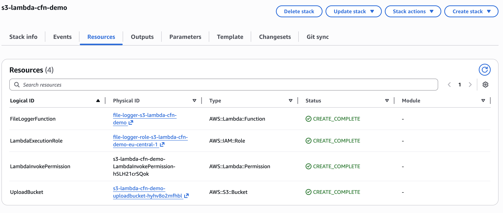
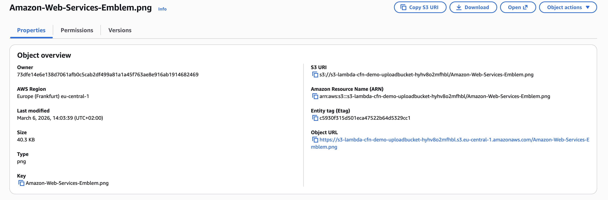
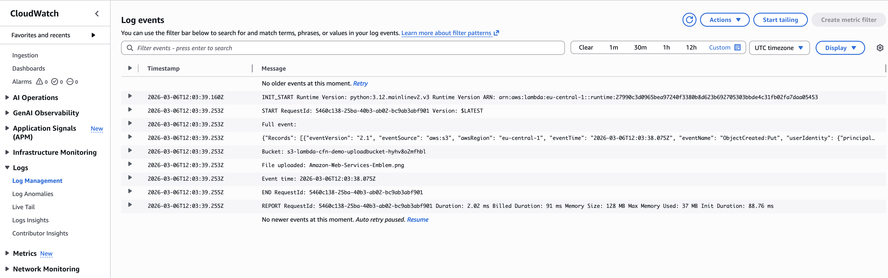
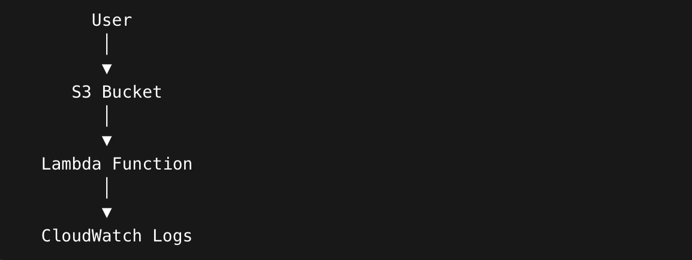
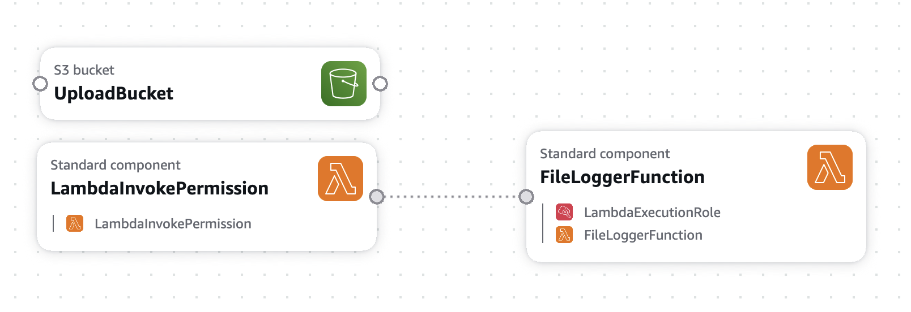

# AWS S3 → Lambda Event Trigger
### Serverless Event-Driven Architecture with Infrastructure as Code

[](https://aws.amazon.com/cloudformation/)
[](https://aws.amazon.com/lambda/)
[](https://aws.amazon.com/s3/)
[](https://aws.amazon.com/cloudformation/)

---

## Overview

This project demonstrates a fully automated, event-driven AWS architecture deployed entirely through Infrastructure as Code (IaC). A file upload to S3 automatically triggers a Lambda function that captures and logs event metadata to CloudWatch — with zero manual wiring required.

The entire stack is provisioned in a single CloudFormation template, making it reproducible, version-controlled, and production-ready.

---

## Architecture

```
User Upload
    │
    ▼
Amazon S3 Bucket  ──(S3 Event Notification)──▶  AWS Lambda  ──▶  CloudWatch Logs
    │                                                │
    └── Stores uploaded object                       └── Logs: bucket name, filename, timestamp
```

---

## Project Structure

```
aws-s3-lambda-cloudformation/
│
├── template for CloudFormation.yaml   # Full IaC stack definition
├── README.md
│
├── cf-stack-overview.png              # CloudFormation stack in AWS Console
├── cf-resources.png                   # Provisioned resources list
├── s3-upload.png                      # File upload to S3
├── cloudwatch-logs.png                # Lambda execution logs
├── architecture-flow.png              # End-to-end event flow
└── visual-designer.png                # CloudFormation Visual Designer view
```

---

## Services Used

| Service | Role |
|---|---|
| **AWS CloudFormation** | Provisions and manages the entire stack as IaC |
| **Amazon S3** | Stores uploaded files and triggers Lambda events |
| **AWS Lambda** | Processes events and logs metadata serverlessly |
| **AWS IAM** | Grants Lambda permission to write to CloudWatch |
| **Amazon CloudWatch** | Stores and displays Lambda execution logs |

---

## What the Lambda Function Logs

On each S3 upload event, the Lambda function extracts and logs:

- **Bucket name** — the source S3 bucket
- **Object key** — the name of the uploaded file
- **Event timestamp** — when the upload occurred

---

## Deployment

### Prerequisites
- An AWS account with IAM permissions to create CloudFormation stacks
- Access to the AWS Management Console or AWS CLI

### Steps

```bash
# Option A: AWS Console
1. Navigate to CloudFormation → Create Stack
2. Upload `template for CloudFormation.yaml`
3. Follow the wizard and confirm resource creation
4. Wait for status: CREATE_COMPLETE

# Option B: AWS CLI
aws cloudformation deploy \
  --template-file "template for CloudFormation.yaml" \
  --stack-name s3-lambda-trigger \
  --capabilities CAPABILITY_IAM
```

### Testing the Trigger

1. Open the S3 bucket created by the stack
2. Upload any file (e.g. `test.txt`)
3. Navigate to **CloudWatch → Log Groups → `/aws/lambda/<function-name>`**
4. Confirm the event metadata appears in the latest log stream

---

## Screenshots

### 1. CloudFormation Stack Overview
*Stack successfully deployed with `CREATE_COMPLETE` status.*



---

### 2. CloudFormation Resources
*All provisioned resources: S3 bucket, Lambda function, IAM role, and CloudWatch log group.*



---

### 3. Uploading a File to S3
*Triggering the pipeline by uploading a test file to the S3 bucket.*



---

### 4. CloudWatch Logs — Lambda Execution
*Lambda successfully invoked. Event metadata (bucket name, key, timestamp) captured in logs.*



---

### 5. Architecture Flow
*End-to-end event flow from S3 upload to CloudWatch log entry.*



---

### 6. CloudFormation Visual Designer
*Visual representation of the stack's resources and their relationships.*



---

## Key Concepts Demonstrated

- **Infrastructure as Code (IaC)** — the entire architecture is defined declaratively in YAML and version-controlled
- **Event-Driven Architecture** — services respond to events automatically with no polling or manual intervention
- **Serverless Computing** — Lambda scales to zero when idle, with no servers to manage
- **Least-Privilege IAM** — Lambda is granted only the permissions it needs to write logs
- **AWS Service Integration** — native S3 event notifications wire directly to Lambda without additional middleware

---

## Author

**Sergiu Gota**  
AWS Certified Solutions Architect – Associate · AWS Cloud Practitioner  
[github.com/sergiugotacloud](https://github.com/sergiugotacloud) · [linkedin.com/in/sergiu-gota-cloud](https://linkedin.com/in/sergiu-gota-cloud)
